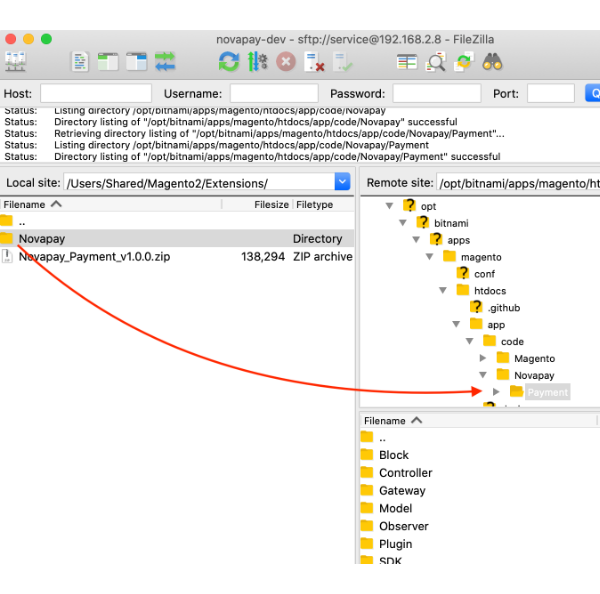
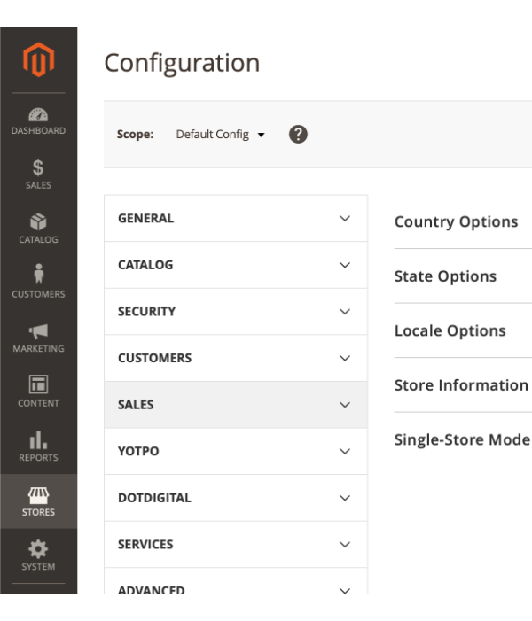
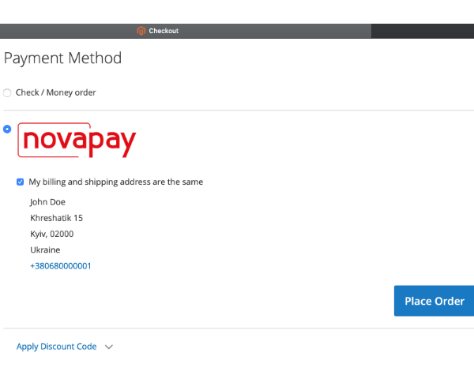

# Magento 2 Novapay Payment Gateway Installation Manual

## FTP Upload

1. Upload files (example with [Filezilla FTP client](https://filezilla-project.org/)) onto your hosting (server/cloud):
    - Connect to your hosting via FTP or SFTP  
    
    - Check the server location of the module, relative to your website root directory `htdocs/app/code/Novapay/`  
    
2. You can use any other available upload method, such as `ssh`, `hosting panel file manager`, etc.

## Administration setup

1. Log in to Admin panel on your website, usually url is `https://your-webshop-domain.com/admin/`, but it might be changed in the configuration.  

2. Go to Extensions.
    - Click on `Stores` in sidebar navigation  
    
    - Click on `Configuration` in opened subnavigation  
    
    - Navigate to `Sales`  
    
    - Navigate to `Payment methods`  
    
    - Scroll down to Novapay payment extension.  
    
3. Configure extension
    - Enable Novapay payment extension.  
    
    When it's enabled you can see subitems (tabs) of the configuration  
    
    - Credentials  
    
        - `Merchant ID` — merchant id provided by Novapay;
        - `Public key` — public key for postback API request;
        - `Private key` — private key for API requests;
        - `Password private key` — password for private key, used only in LIVE mode;
    - Payment options  
    
        - `Title` — title used in the front store;
        - `Payment type` — DIRECT or HOLD type;
        - `Test mode` — LIVE or TEST mode;
    - Urls  
    
        - `Success Url` — url of the successull page after payment processing;
        - `Fail Url` — url of the failed page after payment processing;
    - Status mapping  
    
        - `Payment Action Created` — set the order state when payment created;
        - `Payment Action Expired` — set the order state when payment has expired;
        - `Payment Action Processing` — set the order state when payment is processing;
        - `Payment Action Holded` — set the order state when payment is holded;
        - `Payment Action Hold confirmed` — set the order state when hold payment is confirmed;
        - `Payment Action Hold completion` — set the order state when payment is processing hold;
        - `Payment Action Paid` — set the order state when payment is paid;
        - `Payment Action Failed` — set the order state when payment is failed;
        - `Payment Action Processing void` — set the order state when payment is voiding;
        - `Payment Action Voided` — set the order state when payment is voided;

## Front store test
1. Go to your front store and add some product in the shopping cart. Go to the checkout page and complete `Shipping` step and go to `Review & Payments`.  
  
You should see the **Novapay** logo with the radio button on the left. You can click on the radio button or logo image.
2. There are limitations for **Country**, **Telephone** and **Currency**. 
    - You can see the error message if your address or store currency don't fit the limitations  
    
        - `Country` is only **Ukraine** available;
        - `Telephone` should start with the **+380**;
        - `Currency` is only **UAH** and can be configured in the store settings by Admin.
    - If everything is filled well you can see **Place Order** button  
    