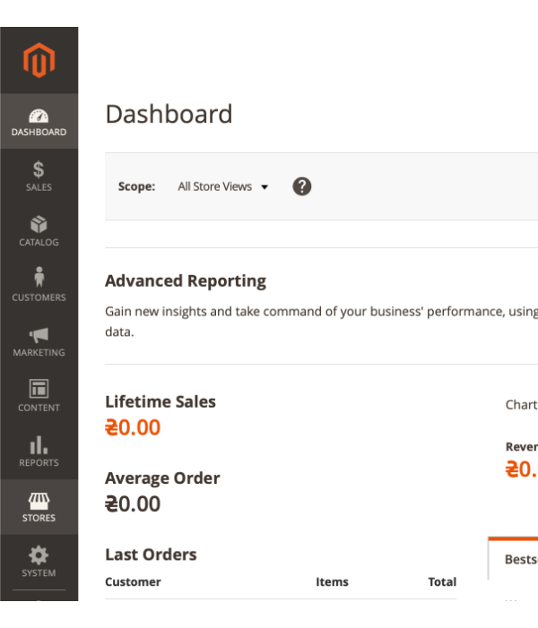
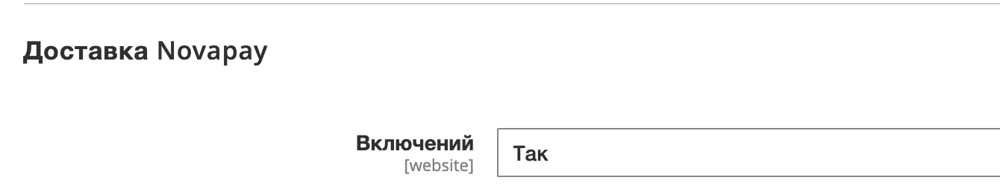
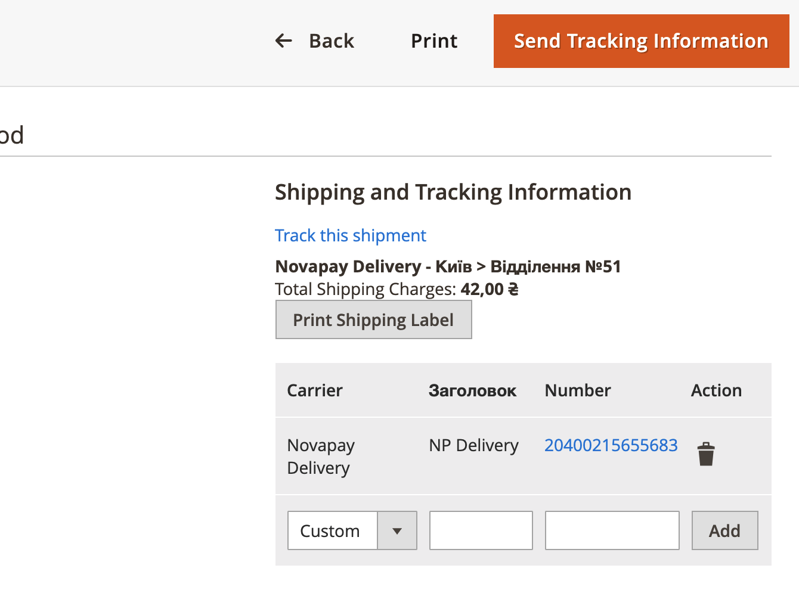

# Magento 2 Novapay Payment Gateway Installation Manual

## FTP Upload

1. Upload files (example with [Filezilla FTP client](https://filezilla-project.org/)) onto your hosting (server/cloud):
    - Connect to your hosting via FTP or SFTP  
    
    - Check the server location of the module, relative to your website root directory `htdocs/app/code/Novapay/`  
    
1. You can use any other available upload method, such as `ssh`, `hosting panel file manager`, etc.

## Administration setup

1. Log in to Admin panel on your website, usually url is `https://your-webshop-domain.com/admin/`, but it might be changed in the configuration.  

### Novapay Delivery extension
> Novapay Delivery extension is dependent on Novapay Payment extension and does not work without it.

1. Go to Extensions.
    - Click on `Stores` in sidebar navigation  
    
    - Click on `Configuration` in opened subnavigation  
    
    - Navigate to `Sales`  
    
    - Navigate to `Delivery methods`  
    
    - Scroll down to Novapay delivery extension.  
    
1. Configure extension
    - Enable Novapay Delivery extension.  
    
    When it's enabled you can see other options of the configuration  
    
    - Options:
        - `Title` - delivery method title
        - `Method Name` — name of the method. In the checkout when warehouse is selected method name is changed to `city > warehouse`
        - `Shipping Cost` — default shipping cost before system can calculate it (warehouse is not selected). Set minimum or average.
        - `Length unit` - product dimensions unit.
            - `Width` - custom attribute correlated with product package width
            - `Height` - custom attribute correlated with product package height
            - `Depth` - custom attribute correlated with product package width
        - `Weight unit` - product weight unit, works only for a custom attribute. Use system value to calculate a standard weight attribute of the product.
            - `Weight` - custom attribute correlated with product package weight. When system value is selected this value is not used.
1. After delivery method setup you can follow orders with selected delivery methods to check tracking number, print it and track the package delivery.
    - Go to Sales > Orders
    
    - View (click) one order with the Novapay delivery
    
    - Check the delivery information in the order below Payment and Shipment method section
    
    - To proceed with the delivery click link button "Confirm delivery"
    
    - After delivery is confirmed click left sidebar navigation "Shipments"
    
    - In this section you can see all the shipments for current order. 
    
    - When shipment is opened you can see important information.
    
    - Scroll down to access tracking and printing functionality.
    .
    - Click "Print Shipping Label" to print Novaposhta delivery document
    
    - Click on the delivery number "20400215655683", popup dialog might be created
    
    - Click on the link to follow your package in th delivery process
    

### Novapay Payment extension
1. Go to Extensions.
    - Click on `Stores` in sidebar navigation  
    
    - Click on `Configuration` in opened subnavigation  
    
    - Navigate to `Sales`  
    
    - Navigate to `Payment methods`  
    
    - Scroll down to Novapay payment extension.  
    
1. Configure extension
    - Enable Novapay payment extension.  
    
    When it's enabled you can see subitems (tabs) of the configuration  
    
    - Credentials  
    
        - `Merchant ID` — merchant id provided by Novapay;
        - `Public key` — public key for postback API request;
        - `Private key` — private key for API requests;
        - `Password private key` — password for private key, used only in LIVE mode;
    - Payment options  
    
        - `Title` — title used in the front store;
        - `Payment type` — DIRECT or HOLD type;
        - `Test mode` — LIVE or TEST mode;
    - Urls  
    
        - `Success Url` — url of the successull page after payment processing;
        - `Fail Url` — url of the failed page after payment processing;
    - Status mapping  
    
        - `Payment Action Created` — set the order state when payment created;
        - `Payment Action Expired` — set the order state when payment has expired;
        - `Payment Action Processing` — set the order state when payment is processing;
        - `Payment Action Holded` — set the order state when payment is holded;
        - `Payment Action Hold confirmed` — set the order state when hold payment is confirmed;
        - `Payment Action Hold completion` — set the order state when payment is processing hold;
        - `Payment Action Paid` — set the order state when payment is paid;
        - `Payment Action Failed` — set the order state when payment is failed;
        - `Payment Action Processing void` — set the order state when payment is voiding;
        - `Payment Action Voided` — set the order state when payment is voided;

## Front store test

### Novapay Delivery extension
1. Go to your front store and add some product in the shopping cart. Go to the checkout page and select `Novapay Delivery` in the `Shipping Methods`.  
    
    > If there is no `Novapay Delivery` some criteria do not meet:
    > 1. `Novapay Delivery` method is not installed or enabled
    > 1. Selected country is not Ukraine. `Novapay Delivery` works only in Ukraine.
    > 1. Some products in your shopping cart have no dimensions or weight defined. All products must have all dimensions (width, height, weight) defined and set up in the Admin > Sales > Delivery methods > Novapay configuration

1. Enter warehouse city and select it from autocomplete dropdown.
1. Enter number of the warehouse and select it from autocomplete dropdown.
    
1. Check the calculated shipping cost.
1. Continue to the next step.

### Novapay Payment extension
1. Go to your front store and add some product in the shopping cart. Go to the checkout page and complete `Shipping` step and go to `Review & Payments`.  
  
You should see the **Novapay** logo with the radio button on the left. You can click on the radio button or logo image.
1. There are limitations for **Country**, **Telephone** and **Currency**. 
    - You can see the error message if your address or store currency don't fit the limitations  
    
        - `Country` is only **Ukraine** available;
        - `Telephone` should start with the **+380**;
        - `Currency` is only **UAH** and can be configured in the store settings by Admin.
    - If everything is filled well you can see **Place Order** button  
    