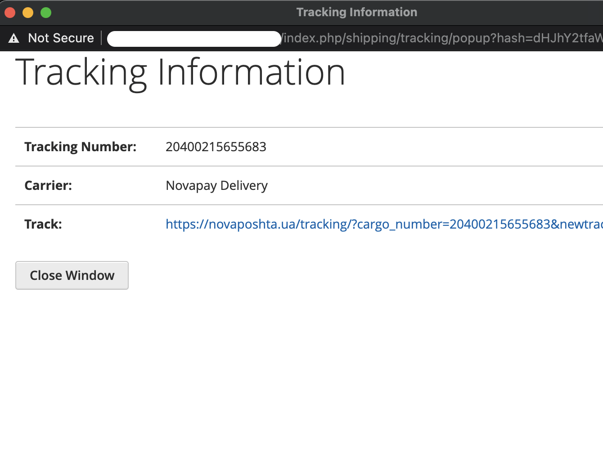
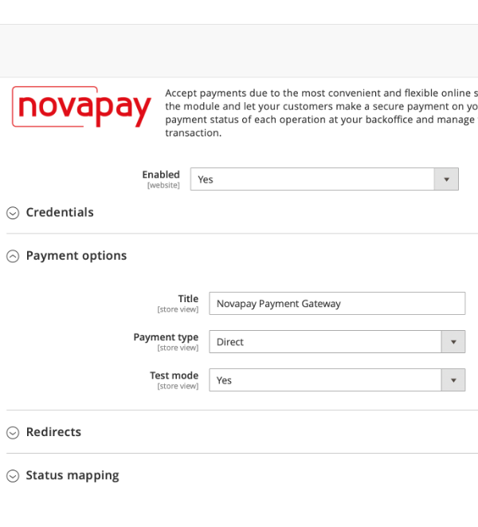

# Руководство по установке платежного шлюза Novapay в Magento 2

## Загрузка по FTP
1. Загрузите файлы (пример с [FTP-клиентом Filezilla] (https://filezilla-project.org/)) на ваш хостинг (сервер / облако):
    - Подключайтесь к вашему хостингу через FTP или SFTP
    
    - Проверьте расположение модуля на сервере относительно корневого каталога вашего интернет магазина `htdocs/app/code/Novapay/`  
    
1. Вы можете использовать любой другой доступный метод загрузки, такой как `ssh`, `файловый менеджер панели хостинга`, другие

## Настройка в панели администрирования

### Настройка системы доставки
> Расширение Novapay Доставка зависит от расширения Novapay Оплата и не работает без него.

1. Перейдите в расширения.
    - Нажмите на `Stores` в боковой навигации  
    
    - Нажмите на `Configuration` в открытом подменю  
    
    - Перейдите в `Sales`  
    
    - Перейдите в `Delivery methods`  
    
    - Пролистайте до расширения Novapay Доставка.  
    
1. Настройте расширение
    - Включите расширение Novapay Доставка.  
    
    Когда расширение включено другие опции доступны  
    
    - Опции:
        - `Title` - заголовок метода доставки
        - `Method Name` — название метода. При оформлении заказа изменяется на `город > отделение` когда выбрано отделение и сумма доставки просчитана
        - `Shipping Cost` — стоимость доставки по умолчанию, до того как выбрано отделение. Установите минимальное значение либо среднее.
        - `Length unit` - единица измерения габаритов.
            - `Width` - дополнительный атрибут, соответствующий длине продукта
            - `Height` - дополнительный атрибут, соответствующий ширине продукта
            - `Depth` - дополнительный атрибут, соответствующий глубине продукта
        - `Weight unit` - единица измерения массы продукта, используется только для дополнительного атрибута. Используйте системное значение чтобы учитывать стандартный атрибут веса продукта.
            - `Weight` - дополнительный атрибут, соответствующий массе продукта. Когда выбрано использовать системное значение данный атрибут не используется.
1. После того как метод доставки настроен и появились заказы с выбранной доставкой в заказах можно видеть трекинговый номер посылки, печатать транспортную накладную и отслеживать посылку.
    - Перейдите в Sales > Orders
    
    - Откройте заказ с доставкой Novapay для просмотра
    
    - Проверьте информацию о доставке ниже секции Payment and Shipment method
    
    - Для доставки заказа необходимо нажать на кнопку `Подтвердить доставку`
    
    - После того как доставка подтверждена можно перейти в раздел `Shipments` в боковой навигации заказа
    
    - В этой секции видны все доставки по данному заказу.
    
    - Когда доставка открыта можно увидеть всю необходимую информацию.
    
    - Пролистайте вниз до трекинговой информации и кнопки печати.
    .
    - Нажмите `Print Shipping Label` чтобы распечатать транспортную накладную
    
    - Нажмите на ссылку `20400215655683`, всплывающее окно должно открыться, если броузер блокирует открытие всплыващих окон - разрешите для этого сайта
    
    - Нажмите на ссылку для отслеживания посылки
    

### Настройка системы оплаты

1. Войдите в панель администратора на своем интернет магазине, обычно URL-адрес `https://your-webshop-domain.com/admin/`, но он может быть изменен в конфигурации.  
  
1. Перейдите в Расширения.
    - Нажмите `Stores` на боковой панели навигации  
    
    - Нажмите `Configuration` в открытой панели  
    
    - Перейдите в `Sales`  
    
    - Перейдите в `Payment methods`  
    
    - Прокрутите вниз до платежного расширения Novapay.  
    
1. Настройте расширение
    - Включите платежный модуль Novapay  
      
    Когда он включен, Вы можете видеть подпункты (вкладки) конфигурации  
      
    - Полномочия  
      
        - `Merchant ID` — идентификатор продавца, предоставляемый Novapay;
        - `Public key` — публичный ключ для запроса postback API;
        - `Private key` — закрытый ключ для запросов API;
        - `Password private key` — пароль к закрытому ключу, используется только в LIVE режиме;
    - Варианты оплаты  
      
        - `Title` — заголовок, используемый в витрине магазина;
        - `Payment type` — тип платежа DIRECT (прямой) или HOLD (УДЕРЖАНИЕ);
        - `Test mode` — LIVE (рабочий) или TEST (тестовый) режим;
    - Urls  
      
        - `Success Url` — url успешной страницы после обработки платежа;
        - `Fail Url` — url страницы с ошибкой после обработки платежа;
    - Соответствие статуса  
      
        - `Payment Action Created` — установить состояние заказа при создании платежа;
        - `Payment Action Expired` — установить состояние заказа по истечении срока платежа;
        - `Payment Action Processing` — установить состояние заказа при обработке платежа;
        - `Payment Action Holded` — установить состояние заказа при удержании платежа;
        - `Payment Action Hold confirmed` — установить состояние заказа при подтверждении удержания платежа;
        - `Payment Action Hold completion` — установить состояние заказа при обработке	завершения удержания платежа;
        - `Payment Action Paid` — установить состояние заказа при успешной оплате;
        - `Payment Action Failed` — установить состояние заказа при неудачной оплате;
        - `Payment Action Processing void` — установить состояние заказа при аннулировании платежа;
        - `Payment Action Voided` — установить состояние заказа при аннулировании платежа;

## Тестирование на стороне интернет магазина

### Модуль доставки
1. Перейдите в магазин и добавьте несколько товаров в корзину. Перейдите на страницу оформления заказа и выберите метод доставки `Novapay Delivery` в `Shipping Methods`.  
    
    > Если такой доставки `Novapay Delivery` нет в списке, какой-то из нижеперечисленных критериев не выполнен:
    > 1. `Novapay Delivery` метод не установлен или не включен
    > 1. Выбранная страна не Украина. Метод `Novapay Delivery` работает только в Украине.
    > 1. Некоторые продукты в корзине не имеют габаритов или массы определённой в магазине. Все продукты должны иметь определённые габариты и настроеные соответствия атрибутов Admin > Sales > Delivery methods > Novapay конфигурация.

1. Введите город получателя и выберите его из выпадающего списка.
1. Введите номер отделения и выберите его из выпадающего списка.
    
1. Проверьте поменялась ли сумма доставки.
1. Переходите к следующему шагу оформления заказа.

### Модуль оплаты
1. Зайдите в свой магазин и добавьте товар в корзину. Перейдите на страницу оформления заказа, выполните шаг `Shipping` и перейдите к `Review & Payments`.  
  
Вы должны увидеть логотип **Novapay** с радиокнопкой слева. Вы можете нажать на радиокнопку или изображение логотипа.
1. Существуют ограничения для **Country**, **Telephone** и **Currency**. 
    - Вы можете увидеть сообщение об ошибке, если ваш адрес или валюта магазина не соответствуют ограничениям    
      
        - `Country` доступна только **Ukraine**;
        - `Telephone` должен начинаться с **+380**;
        - `Currency` только **UAH** (гривна) и может быть настроено в административной панели.
    - Если все заполнено правильно, вы можете увидеть кнопку **Place Order**  
      