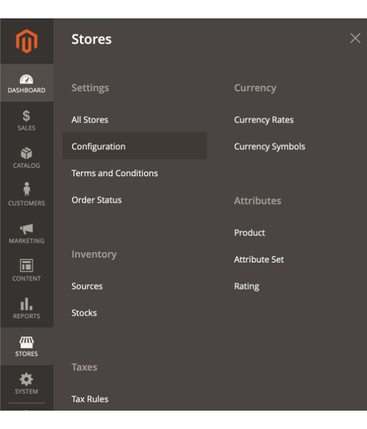
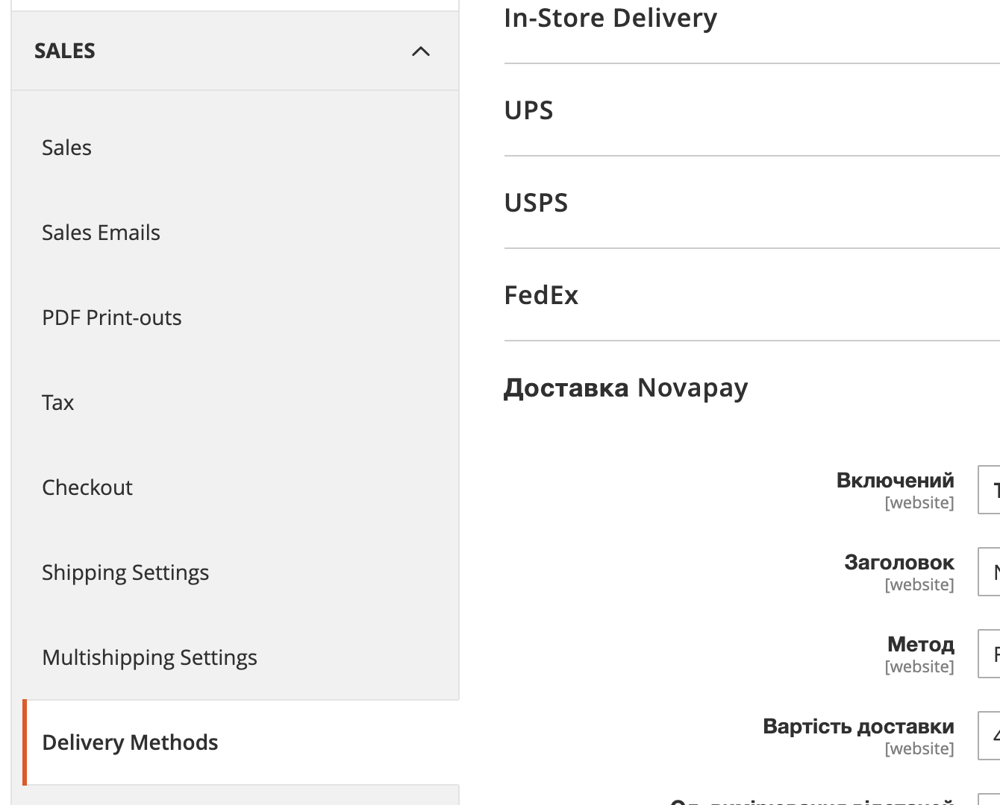
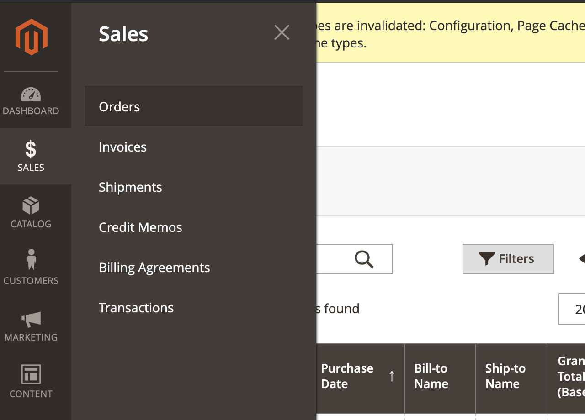
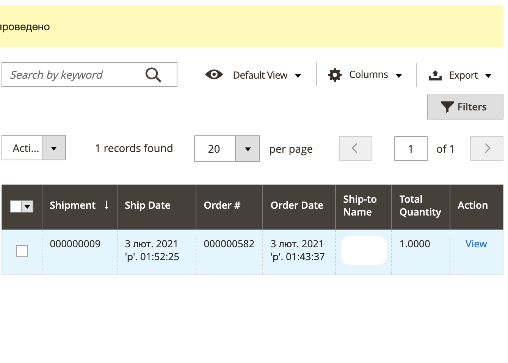
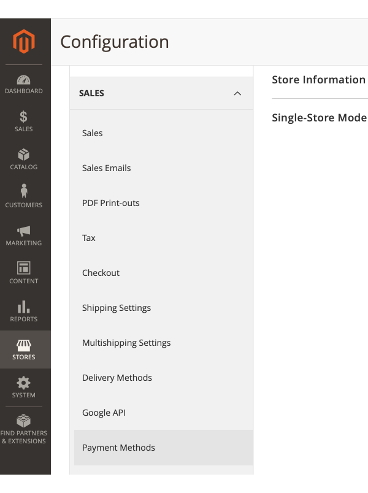
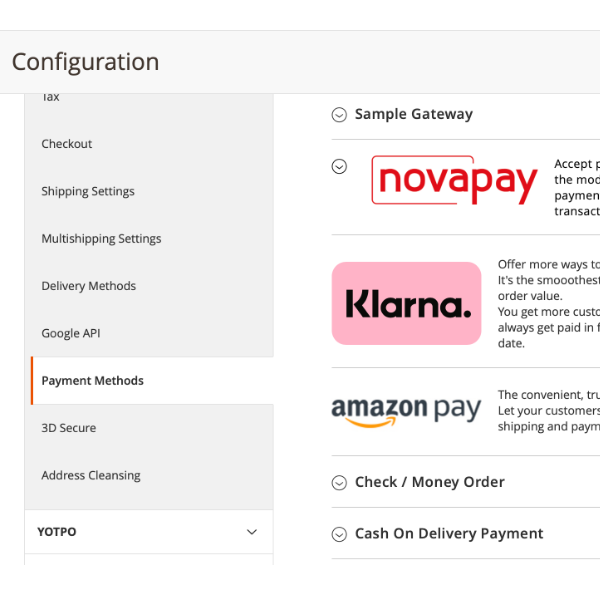
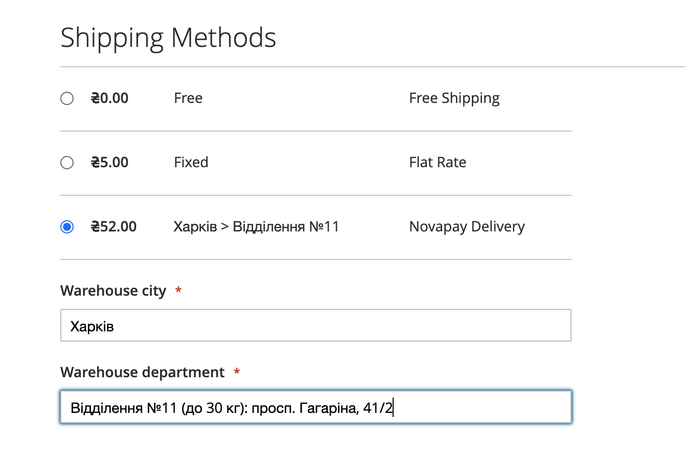

# Посібник із встановлення платіжного шлюзу Novapay в Magento 2

## Завантаження по FTP
1. Завантажте файл (приклад з [FTP-клиентом Filezilla] (https://filezilla-project.org/)) на ваш хостинг (сервер / хмара):
    - Підключитись до вашого хостингу через FTP або SFTP
    
    - Перевірте розташування модуля на сервері щодо кореневого каталогу вашого інтернет магазину `htdocs/app/code/Novapay/`  
    
1. Ви можете використовувати будь-який інший доступний метод завантаження, такий як `ssh`,` файловий менеджер панелі хостінга`, інші.

## Налаштування в панелі адміністрування

### Налаштування системи доставки
> Розширення Novapay Доставка залежить від Novapay Оплата та не працює без нього.

1. Перейдіть до розширення.
    - Натисніть на `Stores` в боковій навігації  
    
    - Натисніть на `Configuration` у відкритому підменю  
    
    - Перейдіть в `Sales`  
    
    - Перейдіть в `Delivery methods`  
    
    - Пролистайте до розширення Novapay Доставка.  
    
1. Налаштуйте розширення
    - Увімкніть розширення Novapay Доставка.  
    
    Коли розширення увімкнуте інші опції доступні  
    
    - Опції:
        - `Title` - заголовок метода доставки
        - `Method Name` — назва метода. При оформлені замовлення змінюється на `місто > відділення` коли відділення обране та сума доставки розрахована
        - `Shipping Cost` — вартість доставки за замовченням, до того як обрано відділення. Встановіть мінімальне значення або середнє.
        - `Length unit` - одиниця виміру габаритів.
            - `Width` - додатковий атрибут, відповідаючий довжині продукта
            - `Height` - додатковий атрибут, відповідаючий ширині продукта
            - `Depth` - додатковий атрибут, відповідаючий глибині продукта
        - `Weight unit` - одиниця виміру маси продукта, використовується тільки для додаткового атрибута. Використовуйте системне значення щоб рахувати стандартний атрибут ваги продукта.
            - `Weight` - додатковий атрибут, відповідаючий масі продукта. Коли вибрано системне значення даний атрибут не використовується.
1. Коли метод налаштован та з'явились замовлення з цим методом, можна побачити трекінговий номер посилки, роздрукувати транспортну накладну та відстежувати посилку.
    - Перейдіть в Sales > Orders
    
    - Відкрийте замовлення з доставкою Novapay для перегляду
    
    - Перевірте інформацію про доставку нижче секції Payment and Shipment method
    
    - Для доставки замовлення треба натиснути кнопку `Подтвердить доставку`
    
    - Після того як доставка підтверджена можна перейти у розділ `Shipments` в боковій навігації замовлення
    
    - В цій секції є всі доставки по данному замовленню.
    
    - Коли доставка відкрита можна побачити всю необхідну інформацію.
    
    - Пролистайте вниз до трекінгової інформації так кнопки друку.
    .
    - Натисніть `Print Shipping Label` щоб роздрукувати транспортну накладну.
    
    - Натисніть на посилання `20400215655683`, спливаюче вікно має відкритись, якщо браузер блокує спливаючі вікна - дозвольте це для цього сайту.
    
    - Натисніть на посилання для відстеження посилки.
    

### Налаштування платіжної системи

1. Увійдіть в панель адміністратора на своєму інтернет магазині, зазвичай URL-адреса `https://your-webshop-domain.com/admin/`, але вона може бути змінений в конфігурації.  
  
1. Перейдіть в Розширення.
    - Натисніть `Stores` на бічній панелі навігації  
    
    - Натисніть `Configuration` у відкритій панелі  
    
    - Натисніть `Sales`  
    
    - Натисніть `Payment methods`  
    
    - Прокрутіть вниз до платіжного розширення Novapay.  
    
1. Налаштуйте розширення
    - Увімкніть платіжний модуль Novapay.  
      
    Коли він включений, Ви можете бачити підпункти (вкладки) конфігурації  
      
    - Повноваження  
      
        - `Merchant ID` — ідентифікатор продавця, що надається Novapay;
        - `Public key` — публічний ключ для запиту postback API;
        - `Private key` — закритий ключ для запитів API;
        - `Password private key` — пароль до закритого ключа, використовується тільки в LIVE (робочому) режимі;
    - Варіанти оплати  
      
        - `Title` — заголовок, який використовується в вітрині магазину;
        - `Payment type` — тип платежу DIRECT (прямий) або HOLD (утримання);
        - `Test mode` — LIVE (робочий) або TEST (тестовий) режим;
    - Urls  
      
        - `Success Url` — url успішної сторінки після обробки платежу;
        - `Fail Url` — url сторінки з помилкою після обробки платежу;
    - Відповідність статусу  
      
        - `Payment Action Created` — встановити стан замовлення при створенні платежу;
        - `Payment Action Expired` — встановити стан замовлення після закінчення терміну платежу;
        - `Payment Action Processing` — встановити стан замовлення при обробці платежу;
        - `Payment Action Holded` — встановити стан замовлення при утриманні платежу;
        - `Payment Action Hold confirmed` — встановити стан замовлення при підтвердженні утримання платежу;
        - `Payment Action Hold completion` — встановити стан замовлення при обробці завершення утримання платежу;
        - `Payment Action Paid` — встановити стан замовлення при успішну оплату;
        - `Payment Action Failed` — встановити стан замовлення при невдалій оплаті;
        - `Payment Action Processing void` — встановити стан замовлення при процесінгу анулюванні платежу;
        - `Payment Action Voided` — встановити стан замовлення при анулюванні платежу;

## Тестування на стороні інтернет магазину
### Модуль доставки
1. Перейдіть в магазин та додайте декілька товарів у кошик. Перейдіть на сторінку оформлення замовлення та виберіть метод доставки `Novapay Delivery` в `Shipping Methods`.  
    
    > Якщо така доставка `Novapay Delivery` відсутня в списку, якись з критерієв не виконується:
    > 1. `Novapay Delivery` метод не встановлен або не активован
    > 1. Обрана країна не Україна. Метод `Novapay Delivery` працює тільки в Україні.
    > 1. Деякі продукти в кошику не мають габаритів або маси встановлені в магазині. Всі продукти мають мати встановлені габарити та вагу, і всі відносини до цих атрібутів мають буту налаштовані Admin > Sales > Delivery methods > Novapay.

1. Введіть місто одержувача і виберіть його зі списку.
1. Введіть номер відділення та виберіть його зі списку.
    
1. Перевірте змінилася сума доставки.
1. Переходьте до наступного кроку оформлення замовлення.

### Платіжний модуль
1. Зайдіть в свій магазин і додайте товар в корзину. Перейдіть на сторінку оформлення замовлення, виконайте крок `Shipping` та перейдіть до `Review & Payments`.  
  
Ви повинні побачити логотип **Novapay** з радіокнопкою зліва. Ви можете натиснути на радіокнопку або зображення логотипу.
1. Існують обмеження для **Country**, **Telephone** та **Currency**. 
    - Ви можете побачити повідомлення про помилку, якщо вашу адресу або валюта магазину не відповідають обмеженням    
      
        - `Country` доступна тільки **Ukraine**;
        - `Telephone` повинен починатися з **+380**;
        - `Currency` тільки **UAH** (гривня) та може бути змінена для магазину в адміністративній панелі.
    - Якщо все заповнено правильно, Ви можете побачити кнопку **Place Order**  
      