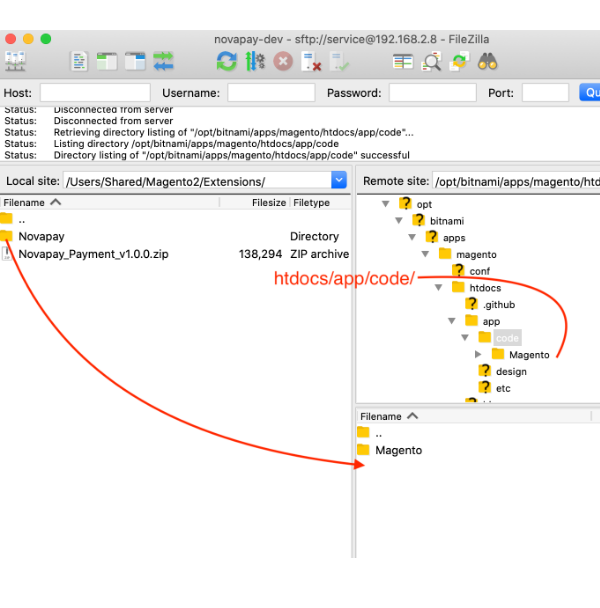
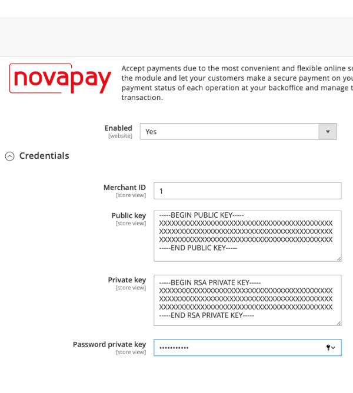
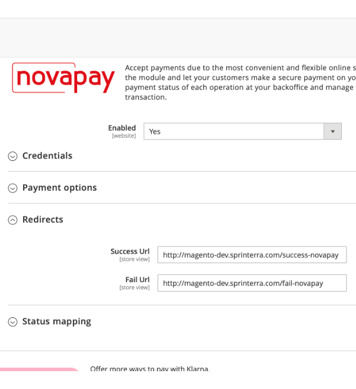

# Посібник із встановлення платіжного шлюзу Novapay в Magento 2

## Завантаження по FTP
1. Завантажте файл (приклад з [FTP-клиентом Filezilla] (https://filezilla-project.org/)) на ваш хостинг (сервер / хмара):
    - Підключитись до вашого хостингу через FTP або SFTP
    
    - Перевірте розташування модуля на сервері щодо кореневого каталогу вашого інтернет магазину `htdocs/app/code/Novapay/`  
    
2. Ви можете використовувати будь-який інший доступний метод завантаження, такий як `ssh`,` файловий менеджер панелі хостінга`, інші.

## Налаштування в панелі адміністрування

1. Увійдіть в панель адміністратора на своєму інтернет магазині, зазвичай URL-адреса `https://your-webshop-domain.com/admin/`, але вона може бути змінений в конфігурації.  
  
2. Перейдіть в Розширення.
    - Натисніть `Stores` на бічній панелі навігації  
    
    - Натисніть `Configuration` у відкритій панелі  
    
    - Натисніть `Sales`  
    
    - Натисніть `Payment methods`  
    
    - Прокрутіть вниз до платіжного розширення Novapay.  
    
3. Налаштуйте розширення
    - Увімкніть платіжний модуль Novapay.  
      
    Коли він включений, Ви можете бачити підпункти (вкладки) конфігурації  
      
    - Повноваження  
      
        - `Merchant ID` — ідентифікатор продавця, що надається Novapay;
        - `Public key` — публічний ключ для запиту postback API;
        - `Private key` — закритий ключ для запитів API;
        - `Password private key` — пароль до закритого ключа, використовується тільки в LIVE (робочому) режимі;
    - Варіанти оплати  
      
        - `Title` — заголовок, який використовується в вітрині магазину;
        - `Payment type` — тип платежу DIRECT (прямий) або HOLD (утримання);
        - `Test mode` — LIVE (робочий) або TEST (тестовий) режим;
    - Urls  
      
        - `Success Url` — url успішної сторінки після обробки платежу;
        - `Fail Url` — url сторінки з помилкою після обробки платежу;
    - Відповідність статусу  
      
        - `Payment Action Created` — встановити стан замовлення при створенні платежу;
        - `Payment Action Expired` — встановити стан замовлення після закінчення терміну платежу;
        - `Payment Action Processing` — встановити стан замовлення при обробці платежу;
        - `Payment Action Holded` — встановити стан замовлення при утриманні платежу;
        - `Payment Action Hold confirmed` — встановити стан замовлення при підтвердженні утримання платежу;
        - `Payment Action Hold completion` — встановити стан замовлення при обробці завершення утримання платежу;
        - `Payment Action Paid` — встановити стан замовлення при успішну оплату;
        - `Payment Action Failed` — встановити стан замовлення при невдалій оплаті;
        - `Payment Action Processing void` — встановити стан замовлення при процесінгу анулюванні платежу;
        - `Payment Action Voided` — встановити стан замовлення при анулюванні платежу;

## Тестування на стороні інтернет магазину
1. Зайдіть в свій магазин і додайте товар в корзину. Перейдіть на сторінку оформлення замовлення, виконайте крок `Shipping` та перейдіть до `Review & Payments`.  
  
Ви повинні побачити логотип **Novapay** з радіокнопкою зліва. Ви можете натиснути на радіокнопку або зображення логотипу.
2. Існують обмеження для **Country**, **Telephone** та **Currency**. 
    - Ви можете побачити повідомлення про помилку, якщо вашу адресу або валюта магазину не відповідають обмеженням    
      
        - `Country` доступна тільки **Ukraine**;
        - `Telephone` повинен починатися з **+380**;
        - `Currency` тільки **UAH** (гривня) та може бути змінена для магазину в адміністративній панелі.
    - Якщо все заповнено правильно, Ви можете побачити кнопку **Place Order**  
      